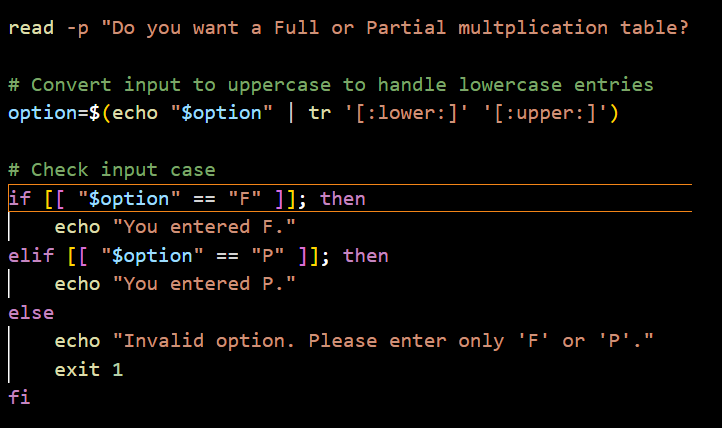
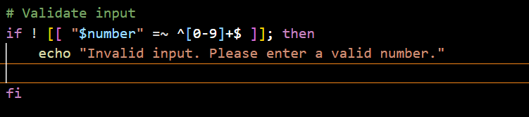
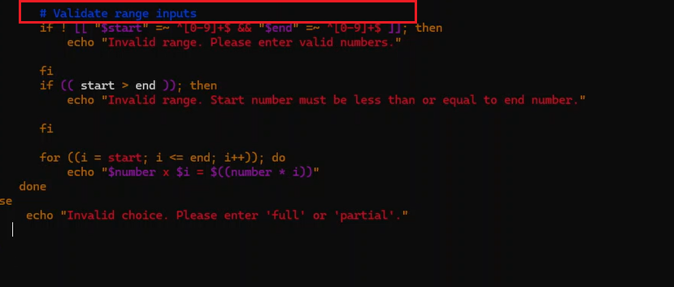
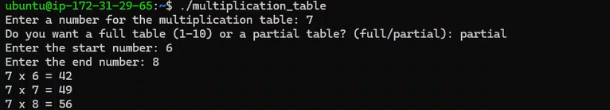

## 1. Prompt the user to enter a number for the multiplication table .

`read -p "enter a whole number: " num`

## 2 . Ask if they want a full table or partial table 

    `if partial, prompt the start and end numbers of the range`

`Ask if they want F or P` 

## 3. Validate the range inputs and handle invalid or out-of-bound entries.

## 4. Generate and display the multiplication table according to the specified range.

## 5. Provide clear output formatting for ease of reading. Bonus

